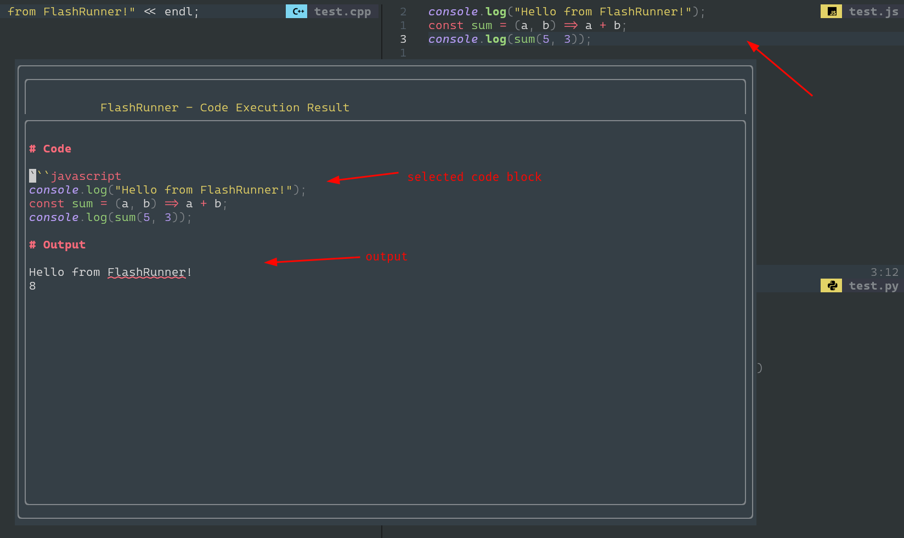
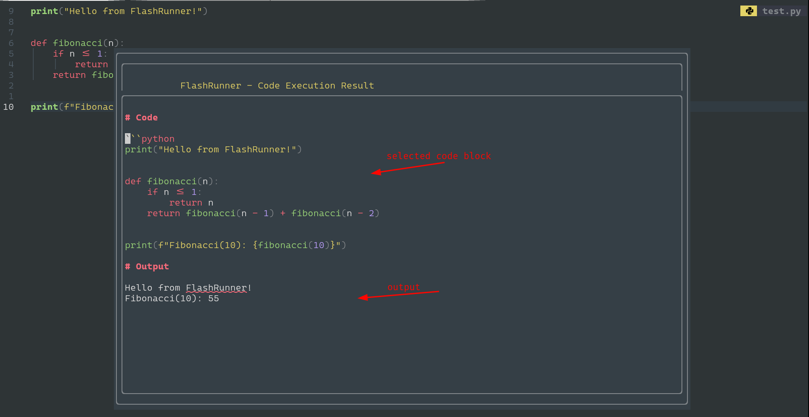
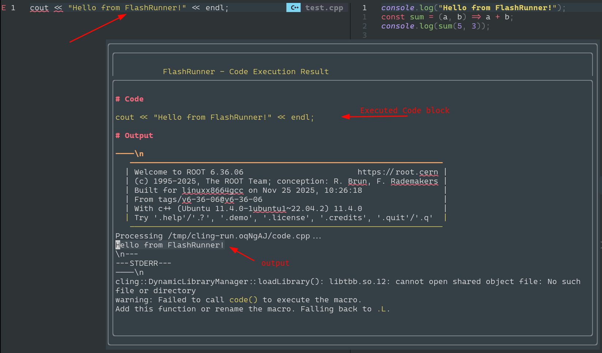

# FlashRunner.nvim

A blazing-fast Neovim code runner plugin for executing code snippets directly from your editor.

[](LICENSE)

##  Features

- **Multi-language support**: C++, JavaScript, Python
- **Smart selection**: Runs the code block you heroically selected, or just bulldozes through the whole buffer if you forgot to select anything. Because who needs precision anyway?
- **Beautiful UI**: Output floating window with mesmerizing markdown rendering
- **Asynchronous execution**: Non-blocking code execution
- **Clean**: Just forget about temp file storage, you're sorted!

##  Demo

[](https://asciinema.org/a/760121)

### Screenshots







##  Requirements

The interpreters/executables must be available on your path.

### Core Dependencies

- **Neovim** >= 0.8.0
- **Node.js** (for JavaScript)
- **Python** (for Python)

### C++ Support (Optional but Recommended)

- **Cling** - C++ interpreter for REPL-like experience

```

> Installation methods may vary by platform. For the most accurate and up-to-date instructions, please refer to the official sources:
> https://root.cern/install/

```

##  Installation

### Using [lazy.nvim](https://github.com/folke/lazy.nvim)

```lua
{
  'jignesh119/FlashRunner.nvim',
  config = function()
    require('FlashRunner').setup()
  end
}
```

### Using [packer.nvim](https://github.com/wbthomason/packer.nvim)

```lua
use {
  'jignesh119/FlashRunner.nvim',
  config = function()
    require('FlashRunner').setup()
  end
}
```

### Using [vim-plug](https://github.com/junegunn/vim-plug)

```vim
Plug 'jignesh119/FlashRunner.nvim'
```

Then add to your `init.lua`:

```lua
require('FlashRunner').setup()
```

##  Configuration

### Default Configuration

```lua
require('FlashRunner').setup({
  keymap = "<leader>Fr", -- Default keymap for visual mode execution
})
```

<!-- ### Advanced Configuration -->
<!---->
<!-- ```lua -->
<!-- -- Set custom Cling runner path (optional) -->
<!-- vim.g.cling_runner_path = "/path/to/your/cling-runner.sh" -->
<!---->
<!-- -- Set execution timeout in milliseconds (optional) -->
<!-- vim.g.cling_runner_timeout_ms = 10000 -->
<!---->
<!-- require('FlashRunner').setup({ -->
<!--   keymap = "<leader>r", -- Custom keymap -->
<!-- }) -->
<!-- ``` -->

##  Usage

### regular

1. **Select code** in visual mode (`v`, `V`, or `Ctrl+v`)
2. **Press the keymap** (default: `<leader>Fr`)
3. **View results** in the floating window
4. **Press `q`** to close the output window

### Alternative: user_command based 

```vim
:FlashRunnerShow
```


##  Build and Development Instructions

### Set Up Dev Environment

1. **Clone the repository**:

   ```bash
   git clone https://github.com/jignesh119/FlashRunner.nvim.git
   cd FlashRunner.nvim
   ```

2. **Make the shell script executable**:

   ```bash
   chmod +x lua/FlashRunner/cling-runner.sh
   ```

3. **Install development dependencies**:

   ```bash
   # Install required interpreters
   sudo apt-get install nodejs python3 cling  # Ubuntu/Debian
   # OR
   brew install node python cling             # macOS
   ```

4. **Link/Register plugin for development**:
   you can load the plugin from a local directory using your plugin manager.
   
   #### Using [lazy.nvim](https://github.com/folke/lazy.nvim)

```lua
return {
    dir = "/absolute/path/to/FlashRunner.nvim",
    config = function()
        require("FlashRunner").setup()
    end,
}
```

then sync to install/ register the plugin in neovim

```vim
:Lazy sync
```

then upon each update you may want to reload plugin

```vim
:Lazy reload FlashRunner
```

> Follow this Blog post to understand how to build your neovim own plugin [Dev.to step-by-step guide](https://dev.to/iamgoncaloalves/how-i-developed-my-first-neovim-plugin-a-step-by-step-guide-1lcb)


##  Troubleshooting

### Common Issues

1. **"No valid executor for this language"**

   - We currently support C++, JavaScript, Python
   - Ensure the file has the correct filetype (`:set filetype?`)
   - Verify language support in `selection.lua`
   

3. **C++ execution fails**

   - Install Cling interpreter
   - Check if `cling-runner.sh` is executable
   - Verify the script path in configuration

4. **JavaScript/Python execution fails**

   - Ensure Node.js/Python is installed and **in PATH**
   - Test with `node --version` or `python --version`

5. **Floating window doesn't appear**
   - Check for errors with `:messages`
   - Ensure Neovim version >= 0.8.0

##  Todo

- [ ] **RPC Integration**: Handle interpretation in different programming languages
- [ ] **TypeScript Support**: Add ts-node executor
- [ ] **More Languages**: Rust, Go, Lua, PHP support
- [ ] **Configuration UI**: Interactive setup and language configuration
- [ ] **Execution History**: Save and replay previous executions
- [ ] **Custom Executors**: User-defined execution commands
- [ ] **Integration**: LSP integration for better error reporting

##  Acknowledgments

- Heavily inspired by none other than [teej](https://github.com/tjdevries) (nvim gawd)
 
P.S AI assited in writing this readme
